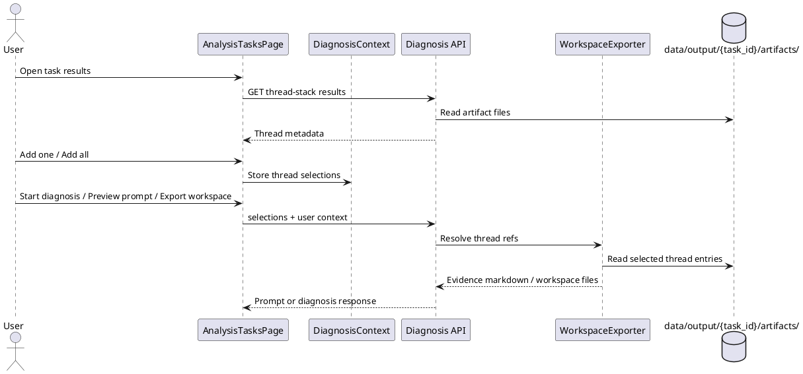

## Context

DiagnoseToolPy already supports a shared diagnosis evidence basket for logs, groups, and clusters. The thread stack parser exists and is validated, but its output is not yet first-class in the diagnosis UX. This change connects those pieces without introducing a new persistence layer or a separate diagnosis workflow.

The design stays within the project's hard constraints:
- file-system source of truth
- no mandatory database
- streaming-friendly handling of large inputs
- assistive diagnosis only

## Overview

This change adds thread stack results as a first-class diagnosis evidence source. The parser already exists, but the project currently has no file-backed task artifact and no UI path for turning parsed thread blocks into evidence basket selections. The design reuses the existing diagnosis workflow instead of creating a separate thread-diagnosis feature.

The core idea is simple:

1. The analyzer writes parsed thread results into task artifacts.
2. The frontend reads those artifacts and renders selectable thread rows.
3. The user adds one thread or all parsed threads to the existing evidence basket.
4. The existing diagnosis, prompt preview, and workspace export flows resolve those selections on demand.

## Goals / Non-Goals

**Goals:**
- Make parsed thread stack results selectable in the diagnosis UI.
- Support add-one and add-all behavior for parsed thread blocks.
- Carry thread evidence through preview, diagnosis, and workspace export.
- Keep the source of truth on disk and avoid introducing a database.
- Preserve the current log/group/cluster evidence flows unchanged.

**Non-Goals:**
- Do not create a separate thread-diagnosis page.
- Do not add mandatory embeddings or vector retrieval.
- Do not change casebase storage or archival formats.
- Do not auto-promote thread evidence to a confirmed root cause.
- Do not add browser upload as the primary way to feed thread evidence.

## Decisions

### 1. Use task artifacts as the source of truth
The analyzer will persist thread results to `data/output/{task_id}/artifacts/` instead of keeping them only in memory or in browser state. This keeps the data rebuildable and consistent with the project's file-system-first rule.

The thread evidence artifact is intentionally separate from the existing `evidence-pack.md` so the parser output can be reloaded, selected, and resolved without re-running the analysis pipeline.

### 2. Extend the existing selection model
The current evidence basket already accepts structured selections for logs, groups, and clusters. The new capability extends that model with thread evidence selections that reference a task artifact entry by opaque `thread_ref`.

That choice is better than embedding raw thread text into the selection payload because:
- it keeps browser state small,
- it avoids duplicating raw evidence in requests,
- it lets the backend resolve the latest artifact content at export time.

### 3. Reuse the current diagnosis/export path
The feature should not introduce a separate prompt-generation path. Instead, `previewPrompt`, `diagnose`, and `exportWorkspace` should accept the extended selection payload and resolve thread references alongside existing evidence types.

This keeps the UX consistent and minimizes risk in the downstream diagnosis orchestration.

### 4. Add a read-only task result API
The frontend needs a task-scoped endpoint that returns thread result metadata for rendering. The endpoint should expose only what the UI needs to select evidence:
- `thread_ref`
- thread name
- thread state
- parse status
- source file and line number
- counts / hints for display
- a short raw excerpt if needed for preview

The full raw content stays on disk and is resolved only when the backend assembles the prompt or workspace export.

### 5. Add-all is a bulk selection action, not a new storage mode
“One-click add” is implemented as selecting all parsed thread rows once and deduplicating them in the same basket. That keeps the model simple and avoids a separate “selected all” persistence state.

## Risks / Trade-offs

- Large dumps can produce many thread rows, which increases UI rendering cost. Mitigation: paginate or virtualize the thread list and keep raw content lazy.
- Stable selection refs must be deterministic. Mitigation: generate refs from task-scoped artifact keys instead of UI row order.
- Export-time resolution can fail if the task artifact is missing or stale. Mitigation: surface a clear error and keep the other evidence selections intact where possible.
- Keeping thread content out of browser state reduces memory use but makes the backend resolver responsible for every export. Mitigation: keep the resolver small, deterministic, and well-tested.

## Data Flow

1. A completed analysis task writes thread results into task artifacts.
2. The Analysis Tasks page fetches the thread result summary for the current task.
3. The user clicks add-one or add-all on parsed thread rows.
4. `DiagnosisContext` stores the new selections in the shared basket.
5. `EvidenceBasket` and `AIDiagnosisButton` render the selected thread evidence alongside existing evidence types.
6. `previewPrompt`, `diagnose`, or `exportWorkspace` sends the extended selection payload.
7. The exporter resolves each `thread_ref` against the task artifact and injects a thread evidence section into the generated markdown.

## Module Responsibilities

### `analyzer`
- Produce the thread-stack artifact from parsed thread dump results.
- Write a human-readable summary and a machine-readable result file.
- Keep the output rebuildable from source logs and parser output.

### `api`
- Expose a read-only task result endpoint for thread stack metadata.
- Accept thread evidence selections in diagnosis, preview, and export requests.
- Reject forged or unknown thread references with a clear error.

### `exporter`
- Resolve thread evidence references against the task artifact.
- Merge thread evidence into the generated prompt and workspace output.
- Preserve the existing handling of log, group, and cluster evidence.

### `frontend`
- Render parsed thread rows in `AnalysisTasksPage`.
- Offer add-one and add-all controls.
- Show parse status and source metadata.
- Keep `EvidenceBasket` and `AIDiagnosisButton` aware of the new selection type.

### `core`
- Keep path validation and file access rules unchanged.
- Continue to guard against traversal and unrestricted reads.

## File Outputs

### New analysis task artifacts

| File | Path | Purpose | Overwrite / Rebuild |
|---|---|---|---|
| `thread-stack-results.jsonl` | `data/output/{task_id}/artifacts/thread-stack-results.jsonl` | One JSON object per parsed thread block, including stable `thread_ref`, metadata, parse status, and raw text or excerpt as needed. | Regenerated when the task reruns. Rebuildable from source logs and parser output. |
| `thread-stack-summary.md` | `data/output/{task_id}/thread-stack-summary.md` | Human-readable summary for UI/debugging. | Regenerated when the task reruns. Rebuildable from the JSONL file. |

### Existing files that may be consumed

- `data/output/{task_id}/evidence-pack.md`
- `data/output/{task_id}/retrieval-query.json`
- `data/output/{task_id}/task.yaml`
- `data/output/{task_id}/progress.json`

The design does not require any mandatory change to durable case storage.

## Error Handling

- If the thread artifact is missing, the UI should show an empty state and the rest of the diagnosis flow should remain usable.
- If one thread entry is malformed, it should be skipped or marked as raw/partial; the page must not crash.
- If a thread reference cannot be resolved at export time, the backend should return a clear 400-level error instead of silently dropping the evidence.
- If a rerun overwrites the task artifact, any stale selections should be treated as stale references and surfaced explicitly.
- If no parsed thread blocks exist, add-all should be disabled and the UI should explain why.

## Security Considerations

- Thread artifact reads must stay scoped to `data/output/{task_id}` and must not permit arbitrary path traversal.
- The frontend should only receive metadata and opaque references, not file-system paths that can be reused outside the app.
- Prompt/export generation must resolve thread evidence server-side to prevent forged payloads from smuggling arbitrary file content.
- Thread dumps may contain sensitive operational data, so the UI should not auto-share them or make them public by default.

## Memory Behavior

- Thread results should be written in a line-oriented format so the analyzer can append incrementally.
- The API should avoid loading all raw thread content into memory when only metadata is needed for the UI.
- The frontend should render metadata and fetch/expand content lazily where practical.
- Export resolution should stream through the JSONL artifact and collect only the selected thread entries, rather than materializing the entire dump in memory.

## Tests

- Analyzer tests should cover artifact generation, stable refs, FULL/PARTIAL/RAW handling, and empty-result behavior.
- API tests should cover successful metadata retrieval, missing task handling, and forged reference rejection.
- Frontend tests should cover add-one, add-all, remove, dedupe, empty state, and disabled add-all behavior.
- Exporter tests should confirm thread evidence appears in generated prompt/workspace output and that invalid refs fail clearly.
- Regression tests should prove that existing log/group/cluster selection behavior remains unchanged.

## Compatibility

- Existing log, group, and cluster evidence selections remain unchanged.
- The new thread evidence type is additive and should not break current diagnosis requests.
- Tasks that do not produce thread artifacts should continue to work exactly as before.
- If the user never opens the thread panel, the current diagnosis flow should behave identically.

## Open Questions

- Should raw thread dumps with no parsed blocks be exposed as a single fallback evidence item, or should the UI only show parsed rows?
- Should the thread panel live inside `AnalysisTasksPage` only, or also be linked from the standalone diagnosis studio?
- Should thread evidence be included in the same markdown section as log evidence, or in a dedicated section inside generated prompts?
