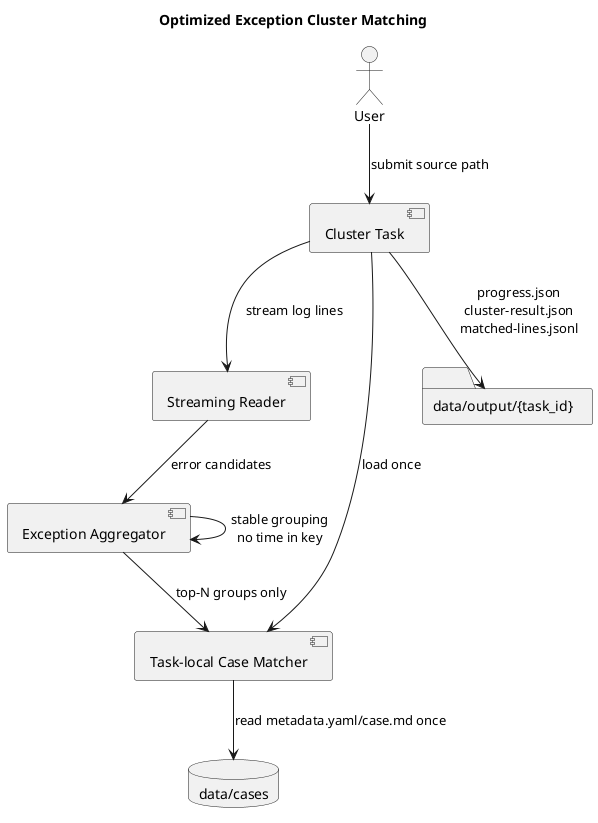

## Context

DiagnoseToolPy processes large server-side log directories by scanning files, streaming log lines, clustering error patterns, and matching clustered exceptions to local historical cases. The user reports that scanning is fast enough, while exception categorization is slow.

The current cluster implementation already avoids loading full log files into memory, but post-scan work can still grow too quickly:

- group keys can include minute-level time fragments
- each group may perform independent keyword, rule, and body matching against `data/cases/`
- case metadata and `case.md` content may be read repeatedly during one cluster task
- progress does not clearly separate aggregation, case matching, and output-writing cost

The design keeps all durable state file-based. Case directories containing `case.md` and `metadata.yaml` remain the source of truth. Any loaded matcher or JSONL index is a rebuildable cache.



## Goals / Non-Goals

**Goals:**

- Reduce exception categorization time after fast scans.
- Prevent time-bucket fragmentation from multiplying cluster groups.
- Reuse loaded case metadata and case body summaries across group matching.
- Bound historical case matching to significant top-N groups while still returning all counted groups.
- Add phase metrics that identify whether time is spent in aggregation, case matching, or cache writing.
- Preserve file-system source of truth and embedding-disabled retrieval.

**Non-Goals:**

- No mandatory database, queue, or external search service.
- No vector retrieval or embedding requirement.
- No frontend redesign.
- No rewrite of server directory scanning.
- No change to archived case storage contracts.
- No AI diagnosis behavior changes.

## Decisions

### 1. Stable Group Keys

Exception cluster identity will be based on exception class when available, otherwise normalized message template. Time fragments MUST NOT be appended to the group key.

Time remains available through `time_distribution`, which is computed from sampled or tracked timestamps per group.

Rationale: The same exception occurring across multiple minutes is still the same category. Time affects severity and timeline, not identity.

### 2. Task-local Case Match Index

At the start of historical matching, the analyzer/retrieval boundary will load a task-local case match index from `data/cases/`.

The loaded representation should include:

- case ID and directory name
- parsed `metadata.yaml` fields used for rule and keyword scoring
- selected `case.md` text sections or summary text used for body matching
- safe status for missing or malformed files

This object lives in memory for the task and is not durable truth. If an optional rebuildable fulltext index exists, it may be used as a source to accelerate loading, but the implementation must still work from case files alone.

Rationale: Matching `G` groups against `C` cases should not require `G * C` filesystem reads.

### 3. Top-N Historical Matching

The cluster task will match historical cases only for the top-N groups by count. All groups remain in the cluster result with counts and samples. Groups outside the matching window receive an empty `matched_cases` list.

The default should be conservative, such as 50 groups, and may become configurable in `config/app.yaml`.

Rationale: The highest-volume groups are the most actionable. Rare groups should not dominate runtime on large inputs.

### 4. Phase Metrics

The cluster workflow will record timing and cardinality metrics for:

- scanning
- aggregating
- matching cases
- writing result/cache files

`progress.json` may expose the latest metrics so polling clients and benchmarks can observe them. A dedicated artifact such as `artifacts/performance-metrics.json` may be added if metrics outgrow progress state.

Rationale: Future performance work needs evidence that distinguishes I/O from grouping and retrieval costs.

### 5. Retrieval Without Embeddings

The optimized matcher must keep the current no-embedding default. Scoring should continue to use metadata fields, exception classes, keywords, key phrases, components, fault modes, tags, and case body text. BM25 remains optional.

Rationale: This preserves the project rule that retrieval must work without embeddings.

## Data Flow

```text
cluster task starts
  -> scan source path and stream log lines
  -> detect exception candidates
  -> aggregate by stable group key
  -> compute counts, bounded samples, and time distribution
  -> sort groups by count
  -> load task-local case match index once
  -> match cases for top-N groups
  -> attach matched cases to those groups
  -> write cluster-result.json
  -> write bounded matched-lines.jsonl
  -> mark progress done with timing metrics
```

## Module Responsibilities

### `api`

- Continue to validate requests and return task status/result.
- MUST NOT implement grouping, retrieval ranking, or file scanning logic.

### `analyzer`

- Own cluster task orchestration.
- Build stable group keys.
- Track group counts, samples, time distribution, and phase metrics.
- Decide top-N group selection for historical matching.
- Write `progress.json`, `cluster-result.json`, and `matched-lines.jsonl`.

### `retrieval`

- Provide reusable case match loading and scoring helpers.
- Load case metadata/body summaries from file-backed casebase.
- Match without embeddings by default.
- Handle malformed case metadata safely.

### `casebase`

- Remains the durable case source through `case.md` and `metadata.yaml`.
- No mandatory changes unless an existing case index rebuild helper is reused.

### `tests/load`

- Report post-scan phase timings and completion behavior.
- Validate that cluster completion is not hidden behind a broad scanning metric.

## File Outputs

Existing outputs remain:

```text
data/output/{task_id}/
├── progress.json
├── cluster-result.json
└── matched-lines.jsonl
```

`progress.json` may add non-breaking fields:

```json
{
  "status": "matching_cases",
  "phase_timings_ms": {
    "scanning": 12000,
    "aggregating": 1800,
    "matching_cases": 900,
    "writing_cache": 300
  },
  "group_count": 128,
  "matched_group_count": 50,
  "case_index_case_count": 240
}
```

If a dedicated metrics artifact is introduced, it should be:

```text
data/output/{task_id}/artifacts/performance-metrics.json
```

This artifact is task output evidence and can be overwritten when the task is rerun.

## Error Handling

- Empty casebase: clustering succeeds with empty `matched_cases`.
- Missing `metadata.yaml`: skip that case and record a safe warning or skipped count.
- Malformed `metadata.yaml`: skip that case and continue matching other cases.
- Missing `case.md`: allow metadata-only matching.
- Matching failure: cluster result should still be written when aggregation succeeded; progress should mark a terminal failed state only if the task cannot safely produce a result.
- Metrics write failure: do not fail the diagnostic result solely because optional metrics could not be written.

## Security Considerations

- Source path validation remains in the API/core path whitelist flow.
- Case matching reads only under the configured local `data/cases/` directory.
- No network calls are introduced.
- No new executable content is loaded from case files.

## Memory Behavior

- Full log files MUST NOT be loaded into memory.
- Aggregation stores counts and bounded samples, not all matched log entries.
- Case match index stores bounded metadata and selected case text, not arbitrary large artifacts.
- Top-N matching prevents low-frequency group cardinality from driving retrieval cost.
- Optional indexes are rebuildable caches and must not become durable truth.

## Tests

Required unit tests:

- grouping does not append minute/hour time fragments to group keys
- time distribution remains available after stable grouping
- two occurrences of the same exception in different minutes produce one group
- task-local case matcher loads case files once and reuses loaded records
- empty casebase returns no matches without failing
- malformed `metadata.yaml` is skipped safely
- missing `case.md` still allows metadata-only matching
- top-N matching leaves groups outside the window counted but unmatched
- embedding-disabled matching remains the default path

Required benchmark verification:

- cluster benchmark reports scan, aggregation, case matching, and cache-writing timings
- large-directory cluster run completes or fails with explicit terminal state and phase evidence
- matching case time does not scale with repeated per-group filesystem scans

## Compatibility

- Existing API response shape can be preserved.
- Existing case directories remain valid.
- Existing `cluster-result.json` readers continue to consume cluster groups and `matched_cases`.
- Existing retrieval without embeddings remains supported.
- Optional new progress fields are additive.

## Risks / Trade-offs

- [Risk] Stable group keys may merge events that users previously saw separated by time.
  - Mitigation: preserve `time_distribution` and samples so timing context remains visible.

- [Risk] Top-N matching may omit useful historical cases for rare groups.
  - Mitigation: all groups remain visible, and the top-N bound can be made configurable.

- [Risk] Loading case body text once may increase memory when the casebase is large.
  - Mitigation: load selected sections or bounded summaries instead of complete large artifacts.

- [Risk] Optional metrics fields could diverge from benchmark artifact names.
  - Mitigation: define shared field names in tests and document them in current-state after implementation.

## Migration Plan

1. Add tests around current grouping and matching behavior.
2. Implement stable group keys and time distribution preservation.
3. Add task-local case match loading/scoring.
4. Apply top-N historical matching.
5. Add phase metrics and benchmark assertions.
6. Update docs and current-state.

Rollback is straightforward: revert the implementation to the prior grouping and matching path. No durable data migration is required.

## Open Questions

- Should top-N default to 20 or 50 groups?
- Should the top-N value be configurable in the first implementation pass?
- Should `performance-metrics.json` be added immediately, or should metrics stay in `progress.json` until the shape stabilizes?
